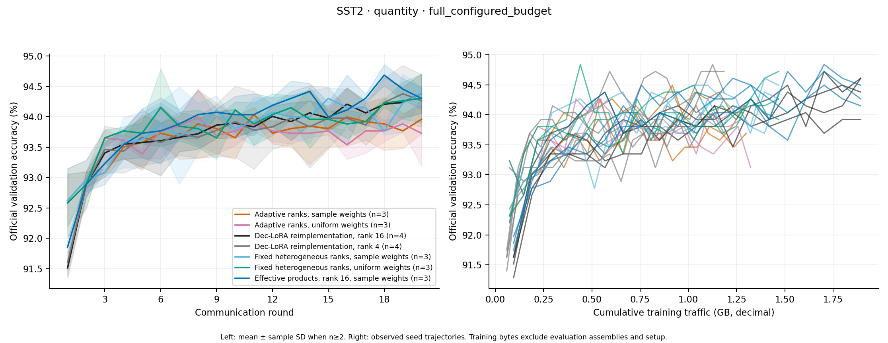
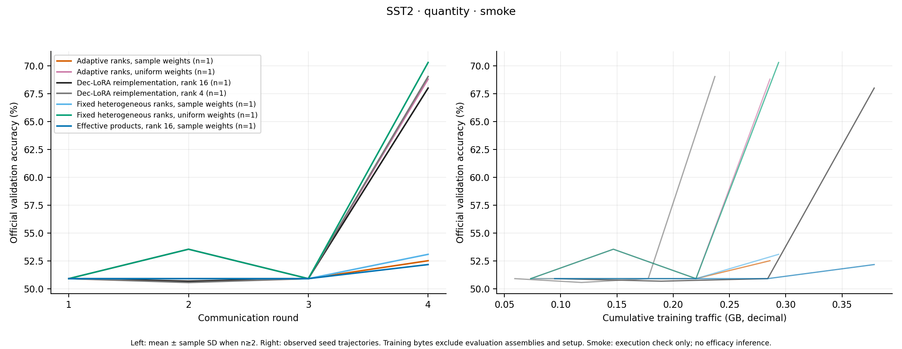

# Quantity-skew decentralized LoRA results

Scores use the official labeled GLUE validation split. SST-2 best validation accuracy is primary; final accuracy is secondary. These are exploratory comparisons of our independent implementations, not hidden-test results or wins over printed paper numbers.

Smoke runs are execution checks only. Their scores and paired arithmetic do not establish efficacy or failure of the proposed method.

Runs: 31 complete, 3 incomplete, 0 invalid. In-progress runs are inventoried only and excluded from every aggregate, paired effect, and figure; any partial round rows retain incomplete status in per_round.csv. Complete runs enter only source/model/data/budget-compatible groups. Smoke and full configured budgets, and equal-size anchors and quantity-skew extensions, remain separate.

Metrics were independently recomputed from saved predictions and validation labels. The standalone checkpoint audit separately verifies best/final inference, source/data integrity, and exact raw prediction matches; its documented model/install-helper dependency is shared. Archived checkpoint binaries may be absent when their exact hashes are bound to that audit. All intervals below are unadjusted Student-t intervals of seed-paired differences; small samples are exploratory, and nonsignificance does not establish parity.

## Group 2ec9b556fbc202fe

SST2 · quantity · full_configured_budget; 20 rounds, batch 32, local steps 211, local epochs 1. Total local updates 42,200; training-example exposures 1,350,400. Source `daced6fc0052f4aab6069aea78ce1468bd5c039b76dedb71080155b0276b8d61`.

A full configured budget means all training data are available and at least 20 rounds run; it does not imply an exact reproduction of the publication's budget. Rank-16 reference arms exceed weaker clients' rank caps. The assembly root stores routed adapter records; neither routing nor raw-data locality establishes privacy.

Primary metric: best validation accuracy (%). Mean ± sample SD across seeds; n=1 has no estimated between-seed uncertainty.

| Method | Seeds | Best primary | Final (secondary) | Training GB | Best + final checkpoint audits |
|---|---:|---:|---:|---:|---:|
| Adaptive ranks, sample weights | 3 | 94.266 ± 0.303 | 93.960 ± 0.239 | 1.292 | 3/3 |
| Adaptive ranks, uniform weights | 3 | 94.228 ± 0.066 | 93.731 ± 0.542 | 1.297 | 3/3 |
| Dec-LoRA reimplementation, rank 16 | 4 | 94.495 ± 0.248 | 94.381 ± 0.324 | 1.893 | 4/4 |
| Dec-LoRA reimplementation, rank 4 | 4 | 94.467 ± 0.379 | 94.266 ± 0.429 | 1.185 | 4/4 |
| Fixed heterogeneous ranks, sample weights | 3 | 94.457 ± 0.132 | 94.381 ± 0.115 | 1.468 | 3/3 |
| Fixed heterogeneous ranks, uniform weights | 3 | 94.534 ± 0.289 | 94.304 ± 0.403 | 1.468 | 3/3 |
| Effective products, rank 16, sample weights | 3 | 94.687 ± 0.175 | 94.304 ± 0.175 | 1.893 | 3/3 |

Paired effects use each seed's own best endpoint, even when best rounds differ. Final-round effects are also recorded in JSON. Main effects average the two within-factor contrasts; the interaction is the difference of those differences.

| Paired effect | Matched seeds | Best endpoint difference (pp) | Exploratory 95% t interval |
|---|---:|---:|---:|
| primary_adaptive_sample_minus_declora16 | 3 | -0.344 ± 0.229 | [-0.914, 0.226] |
| adaptive_sample_minus_feasible_declora4 | 3 | -0.115 ± 0.397 | [-1.102, 0.872] |
| adaptive_sample_minus_product16_sample | 3 | -0.420 ± 0.434 | [-1.499, 0.658] |
| adaptation_at_uniform_weights | 3 | -0.306 ± 0.239 | [-0.899, 0.287] |
| adaptation_at_sample_weights | 3 | -0.191 ± 0.239 | [-0.784, 0.402] |
| sample_weighting_at_fixed_ranks | 3 | -0.076 ± 0.175 | [-0.512, 0.359] |
| sample_weighting_at_adaptive_ranks | 3 | 0.038 ± 0.239 | [-0.555, 0.631] |
| adaptation_main_effect | 3 | -0.248 ± 0.119 | [-0.545, 0.048] |
| sample_weighting_main_effect | 3 | -0.019 ± 0.033 | [-0.101, 0.063] |
| adaptation_by_weighting_interaction | 3 | 0.115 ± 0.413 | [-0.912, 1.142] |

## Group 6923a7f12dc89d05

SST2 · quantity · smoke; 4 rounds, batch 32, local steps 2, local epochs 1. Total local updates 80; training-example exposures 2,560. Source `db671264d9ff4f23f20cbacd08697632d2b68094043a4bbfa3ae11d51c654332`.

A full configured budget means all training data are available and at least 20 rounds run; it does not imply an exact reproduction of the publication's budget. Rank-16 reference arms exceed weaker clients' rank caps. The assembly root stores routed adapter records; neither routing nor raw-data locality establishes privacy.

Primary metric: best validation accuracy (%). Mean ± sample SD across seeds; n=1 has no estimated between-seed uncertainty.

| Method | Seeds | Best primary | Final (secondary) | Training GB | Best + final checkpoint audits |
|---|---:|---:|---:|---:|---:|
| Adaptive ranks, sample weights | 1 | 52.523 (one seed) | 52.523 (one seed) | 0.286 | 1/1 |
| Adaptive ranks, uniform weights | 1 | 68.807 (one seed) | 68.807 (one seed) | 0.286 | 1/1 |
| Dec-LoRA reimplementation, rank 16 | 1 | 68.005 (one seed) | 68.005 (one seed) | 0.379 | 1/1 |
| Dec-LoRA reimplementation, rank 4 | 1 | 69.037 (one seed) | 69.037 (one seed) | 0.237 | 1/1 |
| Fixed heterogeneous ranks, sample weights | 1 | 53.096 (one seed) | 53.096 (one seed) | 0.294 | 1/1 |
| Fixed heterogeneous ranks, uniform weights | 1 | 70.298 (one seed) | 70.298 (one seed) | 0.294 | 1/1 |
| Effective products, rank 16, sample weights | 1 | 52.179 (one seed) | 52.179 (one seed) | 0.379 | 1/1 |

Paired effects use each seed's own best endpoint, even when best rounds differ. Final-round effects are also recorded in JSON. Main effects average the two within-factor contrasts; the interaction is the difference of those differences.

| Paired effect | Matched seeds | Best endpoint difference (pp) | Exploratory 95% t interval |
|---|---:|---:|---:|
| primary_adaptive_sample_minus_declora16 | 1 | -15.482 (one seed) | unavailable (one seed) |
| adaptive_sample_minus_feasible_declora4 | 1 | -16.514 (one seed) | unavailable (one seed) |
| adaptive_sample_minus_product16_sample | 1 | 0.344 (one seed) | unavailable (one seed) |
| adaptation_at_uniform_weights | 1 | -1.491 (one seed) | unavailable (one seed) |
| adaptation_at_sample_weights | 1 | -0.573 (one seed) | unavailable (one seed) |
| sample_weighting_at_fixed_ranks | 1 | -17.202 (one seed) | unavailable (one seed) |
| sample_weighting_at_adaptive_ranks | 1 | -16.284 (one seed) | unavailable (one seed) |
| adaptation_main_effect | 1 | -1.032 (one seed) | unavailable (one seed) |
| sample_weighting_main_effect | 1 | -16.743 (one seed) | unavailable (one seed) |
| adaptation_by_weighting_interaction | 1 | 0.917 (one seed) | unavailable (one seed) |

## Group 99281505a3d75619

SST2 · equal · full_configured_budget; 20 rounds, batch 32, local steps 0, local epochs 1. Total local updates 42,200; training-example exposures 1,346,980. Source `daced6fc0052f4aab6069aea78ce1468bd5c039b76dedb71080155b0276b8d61`.

A full configured budget means all training data are available and at least 20 rounds run; it does not imply an exact reproduction of the publication's budget. Rank-16 reference arms exceed weaker clients' rank caps. The assembly root stores routed adapter records; neither routing nor raw-data locality establishes privacy.

Primary metric: best validation accuracy (%). Mean ± sample SD across seeds; n=1 has no estimated between-seed uncertainty.

| Method | Seeds | Best primary | Final (secondary) | Training GB | Best + final checkpoint audits |
|---|---:|---:|---:|---:|---:|
| Dec-LoRA reimplementation, rank 16 | 1 | 94.151 (one seed) | 94.151 (one seed) | 1.893 | 1/1 |

Paired effects use each seed's own best endpoint, even when best rounds differ. Final-round effects are also recorded in JSON. Main effects average the two within-factor contrasts; the interaction is the difference of those differences.

| Paired effect | Matched seeds | Best endpoint difference (pp) | Exploratory 95% t interval |
|---|---:|---:|---:|
| primary_adaptive_sample_minus_declora16 | 0 | unavailable | unavailable |
| adaptive_sample_minus_feasible_declora4 | 0 | unavailable | unavailable |
| adaptive_sample_minus_product16_sample | 0 | unavailable | unavailable |
| adaptation_at_uniform_weights | 0 | unavailable | unavailable |
| adaptation_at_sample_weights | 0 | unavailable | unavailable |
| sample_weighting_at_fixed_ranks | 0 | unavailable | unavailable |
| sample_weighting_at_adaptive_ranks | 0 | unavailable | unavailable |
| adaptation_main_effect | 0 | unavailable | unavailable |
| sample_weighting_main_effect | 0 | unavailable | unavailable |
| adaptation_by_weighting_interaction | 0 | unavailable | unavailable |

## Run status and verification gaps

- `/home/gogoi/ahlora-quantity-20260917/runs/full-v1-quantity-fixed_sample-seed45` — incomplete: Missing run artifacts: rounds.jsonl
- `/home/gogoi/ahlora-quantity-20260917/runs/full-v1-quantity-fixed_uniform-seed45` — incomplete: Missing run artifacts: rounds.jsonl
- `/home/gogoi/ahlora-quantity-20260917/runs/full-v1-quantity-product16_sample-seed45` — incomplete: Missing run artifacts: rounds.jsonl
